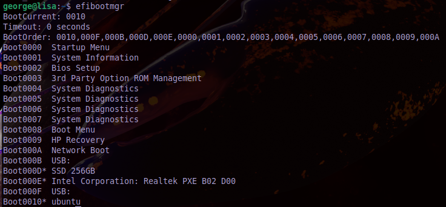

# Booting Procedure

1. The machine’s BIOS or boot firmware loads and runs a boot loader.
2. The boot loader finds the kernel image on disk, loads it into memory, and starts it.
3. The kernel initializes the devices and its drivers.
4. The kernel mounts the root filesystem.
5. The kernel starts a program called init with a process ID of 1. This point is the userspace start.
6. init sets the rest of the system processes in motion.
7. At some point, init starts a process allowing you to log in, usually at the end or near the end of the boot sequence.

You can view the logs that are produced when linux starts up by using the `journalctl`. To view the logs for the current boottime we normally use `journalctl -k`.

Upon startup, the Linux kernel initializes in this general order:
1. CPU inspection
2. Memory inspection
3. Device bus discovery
4. Device discovery
5. Auxiliary kernel subsystem setup (networking and the like)
6. Root filesystem mount
7. User space start

Please note: To determine if your system uses a BIOS or UEFI, run `efibootmgr`. If you get a list of boot targets, your system has UEFI. If instead you’re told that EFI variables aren’t supported, your system uses a BIOS. Alternatively, you can check to see that `/sys/firmware/efi` exists; if so, your system uses UEFI.

<!-- bootloader -->
<!-- Initialisation of the bootloader details -->
# Userspace
<!-- userspace starts -->
User space starts in roughly this order:
1. init
2. Essential low-level services, such as udevd and syslogd
3. Network configuration
4. Mid- and high-level services (cron, printing, and so on)
5. Login prompts, GUIs, and high-level applications, such as web servers

To identify which `init` application you are running check the following directories:
* /usr/lib/systemd
* /etc/init

<!-- systemd -->
